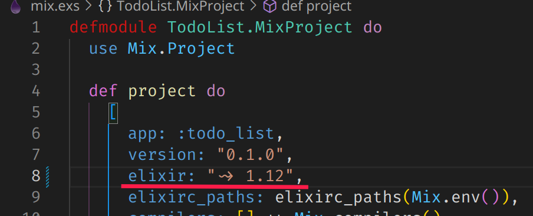

# TodoList

To start your Phoenix server:

  * Install dependencies with `mix deps.get`
    - You need have the elixir and erlang in you machine, here you find how to install elixir and erlang
      https://elixir-lang.org/install.html
      Is preferable use a version manager, for elixir and erlang you use asdf, instructions of instalation by asdf on tutorial above.

  * Create and migrate your database with `mix ecto.setup`
    - You need to have the postgres runing in you machine, if you don't have it run this 
        `docker run -d --name todo_list_dev -e POSTGRES_PASSWORD=postgres -e POSTGRES_USER=postgres -e POSTGRES_DB=postgres -p 5555:5432 postgres`
        you need docker instaled to up postgres with this command, to install docker follow this article
        https://docs.docker.com/engine/install/

        Otherwise of postgres instalation is run `docker-compose up -d database`, you need to have docker-compose and docker up in you machine, to install docker-compose read this article https://docs.docker.com/compose/install/

  * Start Phoenix endpoint with `mix phx.server` or inside IEx with `iex -S mix phx.server`
    
    You have to pay attention in the project version and elixir version running in your machine.
    It's possible change the project version to higher, `1.14` for example.

Now you can visit [`localhost:4000`](http://localhost:4000) from your browser.

Ready to run in production? Please [check our deployment guides](https://hexdocs.pm/phoenix/deployment.html).

This project was write in elixir and phoenix live view and was used hooks in app.js to manipulate the todo list before send a message socket to the back-end.

To understand hooks in phoenix live-view visit the documentation: https://hexdocs.pm/phoenix_live_view/js-interop.html#client-hooks-via-phx-hook

The back-end organization was structured folling context concepts and providing all public methods via api in `lib/todo_list`. Read more about context in elixir here: https://hexdocs.pm/phoenix/contexts.html

Because there is no rest api, it's not necessary access back-end functions via controler, only via api it's enough.

After project is running and you access it on your browser, this is how to interact with the todo list.

- To create your first todo you need press key `Enter` with the cursor inside initial todo.

- Or only rename the initial todo like this

- To delete todo press `Backspace` key after clear todo description, this way:

- To complete todo click on checkbox from the side of input description, this way:

* Run tests with `mix test`
  It is necessary have your postgres running
  
  teste linear connect